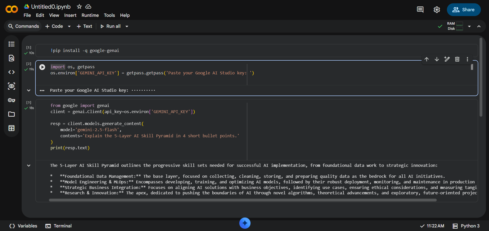

# ai-student-portfolio

# AI Student Bootcamp — <B SRI SURYA LAKSHMI>

Student AI classes
## Day 1 — Setup complete

- ✅ Google AI Studio API key provisioned
- ✅ Groq API key provisioned
- ✅ Hello-Gemini call working — see [Day1_Setup.ipynb](Day1_Setup.ipynb)
- 4-tool comparison matrix from Lab 1A: see screenshot below

## Day 2 Lab 2B — Errors handled 
1. Missing phone number Handled using Optional[str] = None. 
2. Invalid JSON output Retry prompt repairs malformed JSON. 
3. Empty input Validation prevents processing blank resumes.
- Day 2 — Lab 2B: JSON Résumé Extractor — see [Day2_LabA.ipynb](Day2_LabA.ipynb)
- .png)
## Sample résumés processed: 3 / 3 successful\
