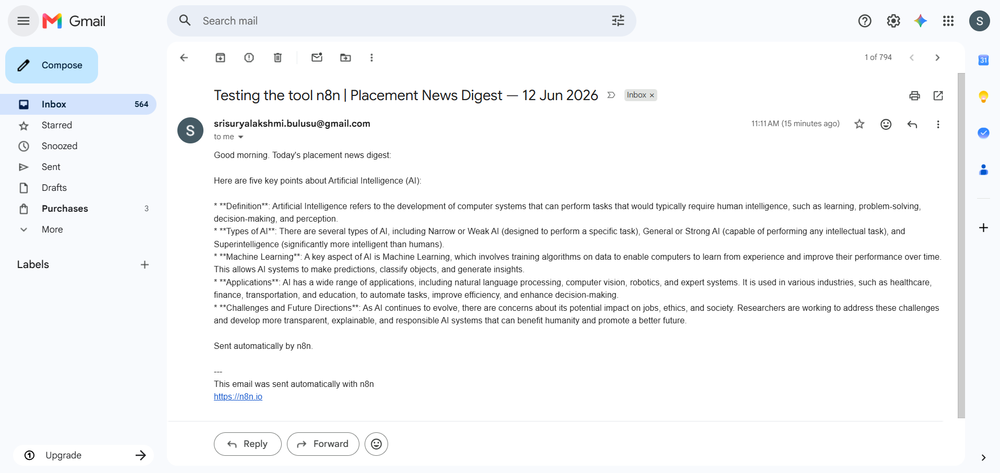

# ai-student-portfolio

# AI Student Bootcamp — <B SRI SURYA LAKSHMI>

Student AI classes

## Day 1 — Setup complete

- ✅ Google AI Studio API key provisioned
- ✅ Groq API key provisioned
- ✅ Hello-Gemini call working — see [Day1_Setup.ipynb](Day1_Setup.ipynb)
- 4-tool comparison matrix completed

---

## Day 2 — Lab 2A: Six-Pattern Drills

### Goal
Apply 6 prompt patterns on Big-O notation.

### Patterns Summary

- **Persona:** Placement-coach style explanation
- **Few-shot:** Learns from Q&A examples
- **Chain-of-thought:** Step-by-step reasoning
- **Structured output:** JSON format response
- **System prompt:** Role-based behavior control
- **Prompt chaining:** Multi-step decomposition

### Reflection
Prompt chaining + persona gave the most useful interview-ready answers.

---

## Day 2 Lab 2B — Errors handled

1. Missing phone number handled using `Optional[str]`
2. Invalid JSON fixed using retry prompts
3. Empty input validation added

- Lab notebook: [Day2_LabB.ipynb](Day2_LabB.ipynb)

.png)

### Sample résumés processed: 3/3 successful

---

## Day 3 — Lab 3A: Verification Chain

### Goal
Verify AI-generated placement statistics using 3-step validation:
AI → Perplexity → Primary source

### Results Summary

| Claim | Verdict |
|------|--------|
| Placement stats set 1 | PARTIAL |
| Placement stats set 2 | VERIFIED |
| Placement stats set 3 | VERIFIED |
| Placement stats set 4 | FALSE |
| Placement stats set 5 | NO SOURCE |

### Key Learning
AI outputs are not always factual — verification is required before use.

---

## Day 3 — Lab 3B: AI Policy (Placement Cell)

### Goal
Create AI usage rules using risk-based classification.

### Risk Levels Used
- Minimal (safe use)
- Limited (allowed with disclosure)
- High-risk (requires checks)
- Unacceptable (banned)

### Summary

**Permitted:** résumé editing, mock interviews, learning support  
**Prohibited:** fake experience, CGPA manipulation, voice cloning  
**Enforcement:** oral checks + document verification + integrity-based compliance

---

## Overall Learning

- Prompt patterns improve AI control and output quality
- Verification is required for factual claims
- AI use in academics needs clear policy boundaries

---

## Day 4 — Lab 4B: n8n Daily News Digest

- ✅ Self-hosted n8n via Docker
- ✅ Workflow: Schedule (7AM IST) → RSS → Gemini summariser → Gmail
- ✅ Workflow JSON committed: [Day4_NewsDigest.json](Day4_NewsDigest.json)
- ✅ Test email screenshot below

